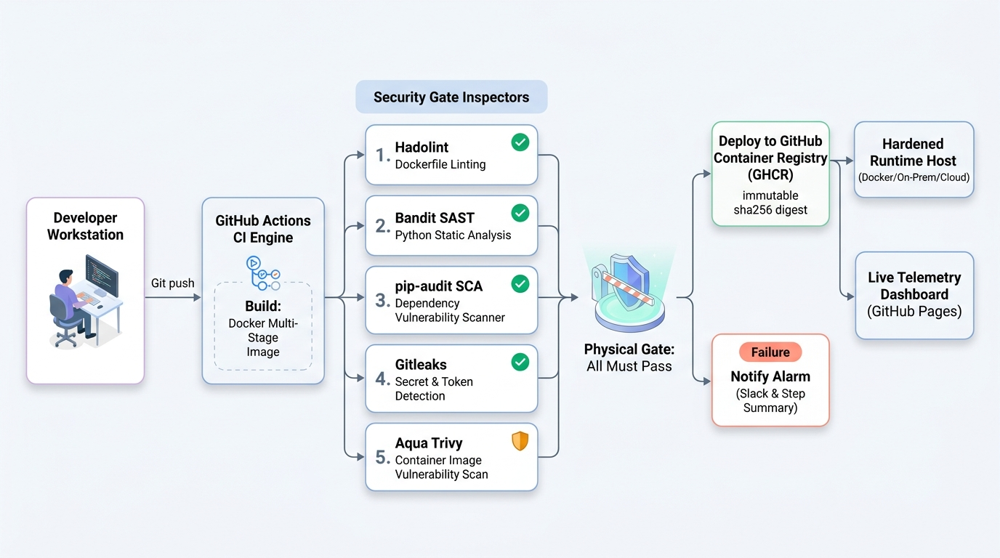

# Architecture

## What this builds

A CI/CD pipeline that builds a container image, runs five automated security
gates against it, and **only publishes it if all six upstream jobs pass**. The gate is not a
report someone reads later — it is the job dependency graph.



```
git push  →  GitHub Actions
               ├─ build       docker build, save the image as an artifact
               ├─ hadolint    Hadolint      → the Dockerfile   (parallel with build)
               ├─ sast        Bandit        → your own source
               ├─ sca         pip-audit     → your dependencies
               ├─ gitleaks    Gitleaks      → committed secrets
               ├─ image-scan  Trivy         → the built artifact
               ├─ deploy      needs: all six, GHCR push, only on main
               └─ notify      if: failure() → per-gate summary + optional Slack

GHCR  →  Any container host (Local / On-prem / Cloud) pulls the scanned digest and runs it
```

## The three planes

| Plane | Runs on | Job |
|---|---|---|
| Development | Windows workstation | author, commit, push. No Docker installed. |
| CI | GitHub-hosted runners | build, scan, gate, publish. Docker is preinstalled. |
| Runtime | Any Docker Host (Local / On-prem / Any VM) | pulls the approved image digest and runs it. No EC2 dependency. |

## Decisions and why

### CI builds the deployed image; the runtime host never does

If the runtime host built the image that got deployed, CI would scan build A and the box
would run build B. The scan would be theatre. So: build exactly once, pass the
image between jobs as an artifact, and publish only those bytes. Provenance is
checkable — the digest CI pushed (`sha256:0a8d320d…`) is the digest the host
runs.

### `--no-index` in the runtime stage

The runtime installs from wheels built in stage 1, with `--no-index`. The build
therefore cannot silently reach PyPI for a dependency `pip-audit` never saw.
Whatever the image contains is whatever `requirements.txt` said, and nothing else.

### Rationale for the three gate settings that differ from the lab write-up

Measured on the run-1 image, `severity: CRITICAL,HIGH`:

```
56 HIGH, 0 CRITICAL
  44 unfixed   ← all Debian 13 OS packages, no upstream fix exists
  12 fixable   ← all our app dependencies
```

`ignore-unfixed: true` makes the gate fail on what this repo can fix. Without it
the gate is red on every commit forever, which teaches people to bypass it.

`bandit -lll` rather than `-ll`, because `-ll` also reports B104
(`host="0.0.0.0"`), which this app always has.

`trivy-action` pinned to `v0.36.0` instead of `@master`, because an unpinned
third-party action executes with the workflow token.

### Build tooling removed from the runtime image

`python:3.11-slim` ships `wheel 0.45.1` and `jaraco.context 5.3.0`, both with
fixable HIGH CVEs. A running container never executes pip, setuptools or wheel.
Removing them beats upgrading them: no new downloads, smaller surface.

### Target host requirements (No cloud VM required)

The project has zero mandatory dependency on AWS or EC2. The container runtime requires only standard Docker on an x86_64 Linux machine (or local Docker Desktop/WSL2):
- **Memory:** ~2 GB RAM (with 2 GB swap recommended for local Trivy scans, as automated in `infra/host-bootstrap.sh`).
- **Disk:** ~5 GB free space (Trivy's vulnerability DB alone unpacks to ~1.4 GB when running local image scans).
- **Architecture:** `amd64` (matches CI's `ubuntu-latest` runner build target).

### Optional cloud sandbox host (EC2)

While an EC2 `t3.small` instance was initially used as an external sandbox to test remote deployments without installing Docker on Windows, it is completely optional. The architecture is 100% cloud-agnostic and functions identically whether deployed to on-premise hardware, a local container engine, or any cloud environment.

## Verified results

| job | run 1 (vulnerable) | run 2 (deps patched) | run 3 (all clean) | run 5 (secret test) |
|---|---|---|---|---|
| build | success | success | success | success |
| hadolint | success | success | success | success |
| sast | **failure** (B602 shell=True) | **failure** | success | success |
| sca | **failure** (74 CVEs) | success | success | success |
| gitleaks | success | success | success | **failure** (leaks found) |
| image-scan | **failure** (12 fixable) | **failure** (2 base CVEs) | success | success |
| deploy | **skipped** | **skipped** | **success** → GHCR | **skipped** |
| notify | success (alerted) | success (alerted) | skipped | **success** (alerted) |

Run 2 is the crucial finding: `sca` green while `image-scan` stayed red. The two
are not redundant — Trivy caught base-image packages that `pip-audit` cannot
see, because they are not in `requirements.txt`. Run 5 proves that committed credentials
are intercepted by Gitleaks and physically block deployment.

Full logs in `evidence/`.
