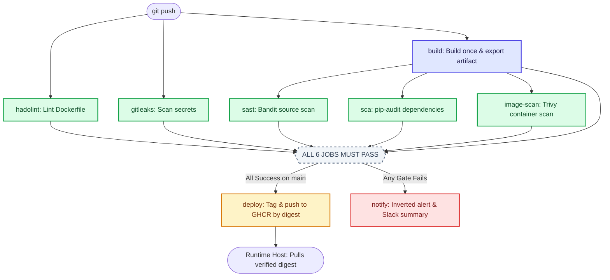

# DevSecOps Architecture Handoff

> **Executive Summary:** This document serves as the comprehensive architectural reference for the DevSecOps Secure CI/CD Pipeline. It details the design rationale, data flow, security boundaries, dependency graphs, and deployment mechanisms. The system enforces an automated **shift-left security mechanism** where software cannot be published or deployed unless five independent security gates pass. The architecture is **100% cloud-agnostic**, with zero mandatory dependency on AWS or EC2.


---

## 1. Architectural Philosophy: Mechanism Over Policy

Most enterprise security practices rely on **policy**:
* *"Developers must run a security audit before merging."*
* *"A security engineer must sign off on releases."*

Policies break under pressure, deadlines, and human fatigue. This architecture replaces policy with a **deterministic mechanism**:
1. **Physical Gating:** The deployment step declares all security inspection jobs in its `needs:` dependency graph. If any scanner exits with a non-zero exit code (failure), the release job is physically prevented from starting by the GitHub Actions engine.
2. **Single Immutable Artifact:** The container image is built **exactly once** in the build stage, archived as an artifact, and passed down the pipeline. Downstream scanners inspect those exact bytes, and the deployment stage publishes those exact bytes. We never scan build A and ship build B.
3. **Supply-Chain Provenance:** Every deployment pins an unforgeable cryptographic hash (`sha256:...` digest) rather than a mutable tag like `:latest`.
4. **Cloud-Agnostic & Self-Contained:** The pipeline orchestrates completely on GitHub-hosted ephemeral runners and publishes to GitHub Container Registry (GHCR). Deployments run on any target with Docker installed (local workstations, on-prem servers, or cloud virtual machines).

---

## 2. The Five System Planes

```
┌─────────────────────────────────────────────────────────────────────────────────────────────────┐
│                                    DEVSECOPS SYSTEM PLANES                                      │
├─────────────────────┬──────────────────────┬─────────────────────┬───────────────┬──────────────┤
│ 1. DEVELOPER PLANE  │ 2. CI ORCHESTRATION  │ 3. SECURITY GATES   │ 4. REGISTRY   │ 5. RUNTIME   │
│ (Local / Authoring) │ (GitHub Actions)     │ (5 Inspectors)      │ (GHCR)        │ (Target Host)│
├─────────────────────┼──────────────────────┼─────────────────────┼───────────────┼──────────────┤
│ • Git Workstation   │ • Ephemeral Runners  │ • Hadolint (Docker) │ • Immutable   │ • Pull-Based │
│ • Python/Flask App  │ • Minimal Perms      │ • Bandit (SAST)     │   Digests     │ • Hardened   │
│ • Local Scanner     │ • Artifact Storage   │ • pip-audit (SCA)   │ • Versioned   │   Compose    │
│   (devsecops-scan)  │ • Dependency Graph   │ • Gitleaks (Secrets)│   Releases    │ • Non-Root   │
│ • Pre-push Hooks    │ • Step Summaries     │ • Trivy (Image)     │ • Zero AWS    │ • Rollback   │
└─────────────────────┴──────────────────────┴─────────────────────┴───────────────┴──────────────┘
```

### Plane 1: Developer / Workstation Plane
* **Responsibility:** Code authoring, dependency declarations, and local pre-commit validation.
* **Tools:** Git, Python 3.11, Docker (optional for local testing).
* **Feedback Loop Optimization:** Waiting 4 minutes for CI to flag a linting error slows developers down. The [`bin/devsecops-scan`](file:///C:/Users/keert/Desktop/Projects/DevSecOps/bin/devsecops-scan) utility replicates all CI gates locally using the identical pinned container images, allowing instant validation before running `git push`.

### Plane 2: CI Orchestration Plane (GitHub Actions)
* **Responsibility:** Pipeline execution, runner lifecycle, and dependency gating.
* **Workflow:** [`.github/workflows/devsecops.yml`](file:///C:/Users/keert/Desktop/Projects/DevSecOps/.github/workflows/devsecops.yml).
* **Least Privilege Isolation:**
  * Global permissions are locked down: `permissions: contents: read`.
  * The `GITHUB_TOKEN` cannot write to packages or modify repository settings.
  * Only the `deploy` job explicitly escalates `packages: write`—and only for itself during publication.
* **Fail-Fast Parallelism:** Non-dependent jobs (`build`, `hadolint`, `gitleaks`) launch concurrently at the start of the run. A flawed Dockerfile fails in ~5 seconds rather than waiting for image generation.

### Plane 3: Security Inspection Gate Plane
The core defensive perimeter consisting of five specialized, non-overlapping inspection gates:

| Gate | Tool | Target Inspected | Failure Threshold | Why It Cannot Be Omitted |
| :--- | :--- | :--- | :--- | :--- |
| **Lint** | Hadolint v2.12.0 | `app/Dockerfile` | `warning`+ (DL3002 root, DL3007 unpinned) | Catches dangerous container blueprints before compilation. |
| **SAST** | Bandit v1.9.4 | Source code (`app/`) | High severity (e.g. B602 command injection) | Inspects developer-written code patterns without running the app. |
| **SCA** | pip-audit | Dependencies (`requirements.txt`)| Any known CVE (OSV/PyPI databases) | Detects vulnerabilities in consumed third-party open-source libraries. |
| **Secrets** | Gitleaks v8.28.0 | Git tree & commits | Any unencrypted credential / API key | Scans for high-entropy strings and leaked tokens that SAST/SCA ignore. |
| **Artifact** | Aqua Trivy v0.36.0| Final image (`bcssl-demo-app`) | Fixable CRITICAL & HIGH | Inspects runtime OS packages and base layer binaries invisible to SCA. |

### Plane 4: Artifact & Registry Plane (GHCR)
* **Responsibility:** Secure, immutable storage for verified container images.
* **Registry:** GitHub Container Registry (`ghcr.io/venkatvellapalem/devsecops`).
* **Digest Binding:**
  * When `docker push` uploads an image, the registry generates an immutable cryptographic SHA256 digest (e.g. `sha256:0a8d320d...`).
  * Tags like `:latest` or git commit SHAs can be reassigned; digests **cannot**. Deployments explicitly reference the digest to guarantee provenance.

### Plane 5: Runtime Deployment Plane (Target Host)
* **Responsibility:** Hosting the verified container in a hardened runtime environment.
* **Target Options:** Any machine with Docker (On-Premise Linux server, Local Developer machine, WSL2, or Cloud VM). **No EC2 or AWS dependency is required.**
* **Pull-Based Deployment:** The runtime host pulls images from GHCR via [`deploy/update.sh`](file:///C:/Users/keert/Desktop/Projects/DevSecOps/deploy/update.sh). The host never runs a GitHub Actions self-hosted runner (which would introduce severe remote code execution risks on a public repository).
* **Runtime Hardening:**
  * Container runs as non-root user (`appuser`, UID `10001`).
  * All Linux capabilities dropped (`cap_drop: ALL`).
  * Escalation blocked (`no-new-privileges: true`).
  * Automated container healthcheck hitting `/healthz` every 30s.
  * Instant rollback to the previous digest stored in `/var/lib/devsecops/previous`.

---

## 3. The Execution & Dependency Graph



### The Inverted Notification Pattern
```yaml
notify:
  needs: [build, hadolint, sast, sca, gitleaks, image-scan]
  if: failure()
```
The `notify` job is the exact mathematical inverse of `deploy`. It executes **only** when a gate fails, parsing the failure results of upstream jobs from `${{ needs.<job>.result }}` to render a diagnostic table in the GitHub Actions Step Summary and optionally notify a Slack webhook.

---

## 4. Empirical Evidence: Why Redundancy is Mandatory

A common misconception is that a single scanner (like Trivy or Bandit) is sufficient. The experimental runs on this repository proved that the gates inspect mutually exclusive vulnerability domains:

```
                  ┌────────────────────────────────────────────────────────┐
                  │                 VULNERABILITY COVERAGE                 │
                  ├───────────────────┬────────────────────────────────────┤
                  │ Vulnerability     │ Detecting Security Gate            │
                  ├───────────────────┼────────────────────────────────────┤
                  │ Root user in image│ Hadolint (DL3002)                  │
                  │ Command Injection │ SAST / Bandit (B602)               │
                  │ Outdated Requests │ SCA / pip-audit (74 CVEs)          │
                  │ Committed AWS Key │ Gitleaks (Secret Entropy Scanner)  │
                  │ Base Debian Flaws │ Image Scan / Trivy (OS / Wheels)   │
                  └───────────────────┴────────────────────────────────────┘
```

### The Run 2 Proof (SCA Passed, Trivy Failed)
In **Run 2** ([commit `4f5b136`](https://github.com/venkatvellapalem/DevSecOps/actions/runs/36564538965)):
* `requirements.txt` was upgraded to clean packages.
* **`pip-audit` reported 0 vulnerabilities and exited green.**
* However, **`Trivy` failed on the exact same commit.**
* **Root Cause:** The `python:3.11-slim` base image bundled outdated build utilities (`wheel 0.45.1` with CVE-2026-24049 and `jaraco.context 5.3.0` with CVE-2026-23949). Because these packages came from Debian rather than `requirements.txt`, `pip-audit` was structurally blind to them. Only container image scanning caught them.

---

## 5. Live Observability & Telemetry

The architecture includes a zero-maintenance, client-side dashboard hosted on **GitHub Pages**:
* **URL:** `https://venkatvellapalem.github.io/DevSecOps/`
* **Technology:** Vanilla HTML5, CSS3, and JavaScript (no heavy frameworks, no NodeJS build steps, no backend server).
* **Integration:** Queries the public GitHub REST API directly from the client browser.
* **Telemetry Features:**
  * Real-time pipeline pass/fail status and success percentage.
  * Per-gate inspection cards with execution runbooks.
  * Direct deep-linking to GitHub Actions workflow runs.
  * Automated filtering excluding internal GitHub Pages deployment runs to ensure statistical accuracy.

---

## 6. How to Deploy & Operate

### Step 1: Running the Application Locally
No cloud infrastructure is needed. Pull and run the approved container digest:
```bash
# Resolve and run the latest approved digest
./deploy/update.sh <git-sha>

# Verify application health
curl http://localhost:5000/healthz
# Output: {"status":"healthy"}
```

### Step 2: Running Gates Locally
```bash
# Run all security scanners locally in Docker before pushing
./bin/devsecops-scan
```

### Step 3: Performing a Safe Rollback
If an updated release exhibits unexpected runtime issues, rollback instantly to the previous cryptographic digest:
```bash
./deploy/update.sh --rollback
```

---

## 7. Architectural Threat Model & Boundary Summary

| Threat Vector | Mitigation in Architecture |
| :--- | :--- |
| **Insecure Docker Blueprint** | Hadolint lints Dockerfile instructions; multi-stage build strips compilers. |
| **Code Injection (RCE/SQLi)**| Bandit SAST scans AST for dangerous syntax calls (`shell=True`, `eval`). |
| **Supply Chain Compromise**  | `pip-audit` checks dependency manifests against national CVE registries. |
| **Credential / Token Leakage**| Gitleaks detects committed high-entropy API tokens and secrets. |
| **Base Image Vulnerabilities**| Trivy inspects root filesystem layers and binary packages. |
| **Artifact Tampering**       | Single immutable build; all gates test the exact image passed to GHCR. |
| **Privilege Escalation**     | Container drops root (UID 10001), drops Linux capabilities, prevents setuid. |
| **CI Token Compromise**      | Read-only permissions default; write permissions scoped to deployment job only. |
